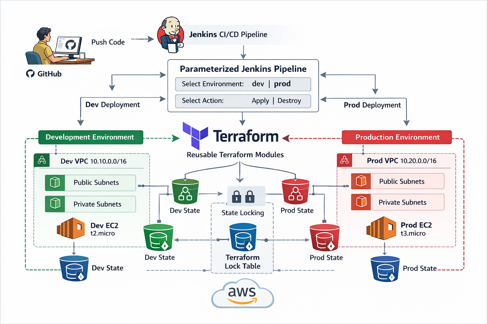

# Terraform AWS Networking Modules with Jenkins CI/CD

## Project Overview

This project demonstrates a **production-style Terraform setup** using:

- **Reusable Terraform modules**
- **Multi-environment deployment** (`dev` and `prod`)
- **Remote Terraform state in S3**
- **State locking using DynamoDB**
- **Jenkins parameterized CI/CD pipeline**
- **AWS VPC with public and private subnet architecture**

The infrastructure is deployed through Jenkins, where the user can choose:

- target environment: `dev` or `prod`
- action: `apply` or `destroy`

This project is designed to showcase **intermediate Terraform and DevOps skills** that are commonly used in real-world cloud infrastructure automation.

---

## Architecture Diagram



---

## Architecture Explanation

The deployment flow works as follows:

1. A developer pushes Terraform code to **GitHub**
2. **Jenkins** pulls the latest code from GitHub
3. Jenkins triggers a **parameterized pipeline**
4. The user selects:
   - environment: `dev` or `prod`
   - action: `apply` or `destroy`
5. Jenkins runs Terraform commands in the selected environment folder
6. Terraform uses **reusable modules** to provision AWS infrastructure
7. Terraform stores state in **S3**
8. Terraform uses **DynamoDB** for state locking
9. AWS infrastructure is created independently for `dev` and `prod`

---

## CI/CD Flow

```text
Developer
   ↓
GitHub
   ↓
Jenkins Pipeline Trigger
   ↓
Select Environment (dev / prod)
   ↓
Select Action (apply / destroy)
   ↓
Terraform Init
   ↓
Terraform Format Check
   ↓
Terraform Validate
   ↓
Terraform Plan
   ↓
Manual Approval
   ↓
Terraform Apply / Destroy
   ↓
AWS Infrastructure
````

---

## AWS Infrastructure Created

For each environment, Terraform provisions:

* VPC
* 2 Public Subnets
* 2 Private Subnets
* Internet Gateway
* NAT Gateway
* Public Route Table
* Private Route Table
* Route Table Associations
* Security Group
* EC2 Instance in Private Subnet

---

## Environment Details

### Development Environment

* VPC CIDR: `10.10.0.0/16`
* Public Subnets:

  * `10.10.1.0/24`
  * `10.10.2.0/24`
* Private Subnets:

  * `10.10.11.0/24`
  * `10.10.12.0/24`
* EC2 Instance Type: `t2.micro`

### Production Environment

* VPC CIDR: `10.20.0.0/16`
* Public Subnets:

  * `10.20.1.0/24`
  * `10.20.2.0/24`
* Private Subnets:

  * `10.20.11.0/24`
  * `10.20.12.0/24`
* EC2 Instance Type: `t3.micro`

---

## Key Terraform Concepts Covered

This project demonstrates the following Terraform concepts:

### 1. Modules

Reusable modules are created for:

* VPC
* Subnets
* EC2

This keeps the code modular, reusable, and easier to maintain.

### 2. Remote State

Terraform state is stored in **Amazon S3** instead of local files.

Benefits:

* centralized state management
* better team collaboration
* safer infrastructure operations

### 3. State Locking

Terraform uses **DynamoDB** to prevent multiple users or pipelines from modifying state at the same time.

### 4. Multi-Environment Design

The same reusable modules are used for both:

* `dev`
* `prod`

Only the environment-specific values change.

### 5. Public and Private Subnet Architecture

* public subnets route traffic through the **Internet Gateway**
* private subnets route outbound traffic through the **NAT Gateway**
* EC2 instance is deployed in a **private subnet**

### 6. Parameterized Jenkins Pipeline

The Jenkins pipeline allows environment and action selection at runtime.

---

## Project Structure

```text
terraform-aws-networking-modules-jenkins/
│
├── modules/
│   ├── vpc/
│   │   ├── main.tf
│   │   ├── variables.tf
│   │   └── outputs.tf
│   │
│   ├── subnet/
│   │   ├── main.tf
│   │   ├── variables.tf
│   │   └── outputs.tf
│   │
│   └── ec2/
│       ├── main.tf
│       ├── variables.tf
│       └── outputs.tf
│
├── environments/
│   ├── dev/
│   │   ├── backend.tf
│   │   ├── provider.tf
│   │   ├── variables.tf
│   │   ├── terraform.tfvars
│   │   ├── main.tf
│   │   └── outputs.tf
│   │
│   └── prod/
│       ├── backend.tf
│       ├── provider.tf
│       ├── variables.tf
│       ├── terraform.tfvars
│       ├── main.tf
│       └── outputs.tf
│
├── scripts/
│   └── install_nginx.sh
│
├── jenkins/
│   └── Jenkinsfile
│
├── architecture/
│   └── terraform-aws-networking-modules-Jenkins.png
│
└── README.md
```

---

## Terraform Modules

### VPC Module

Creates:

* VPC
* Internet Gateway

### Subnet Module

Creates:

* Public subnets
* Private subnets
* Elastic IP
* NAT Gateway
* Public route table
* Private route table
* Route table associations

### EC2 Module

Creates:

* Security Group
* EC2 instance in private subnet
* user_data based bootstrap

---

## Remote Backend Configuration

Terraform backend is configured separately for each environment.

### Dev Backend

* S3 bucket for dev state
* DynamoDB lock table

### Prod Backend

* S3 bucket for prod state
* DynamoDB lock table

This ensures proper isolation between environments.

---

## Jenkins Pipeline Features

The Jenkins pipeline includes:

* workspace cleanup before build
* Git checkout
* Terraform version check
* AWS identity check
* Terraform init
* Terraform format validation
* Terraform configuration validation
* Terraform plan
* manual approval
* Terraform apply or destroy
* workspace cleanup after build

---

## Jenkins Parameters

The pipeline supports the following parameters:

### `ENVIRONMENT`

Values:

* `dev`
* `prod`

### `ACTION`

Values:

* `apply`
* `destroy`

This makes the pipeline reusable across multiple environments.

---

## Security Best Practices Used

* Jenkins runs on **AWS EC2**
* Jenkins authenticates to AWS using an **IAM role attached to the EC2 instance**
* No static AWS access key or secret key is stored in Jenkins
* Terraform state is stored remotely in S3
* State locking is enabled using DynamoDB
* EC2 application instance is launched in a **private subnet**
* Security group access is restricted to the VPC CIDR

---

## How to Run Locally

### Deploy Dev Environment

```bash
cd environments/dev
terraform init
terraform fmt -recursive
terraform validate
terraform plan
terraform apply
```

### Deploy Prod Environment

```bash
cd environments/prod
terraform init
terraform fmt -recursive
terraform validate
terraform plan
terraform apply
```

### Destroy Environment

Example for dev:

```bash
cd environments/dev
terraform destroy
```

---

## How to Run from Jenkins

1. Create a Jenkins Pipeline job
2. Configure:

   * Pipeline script from SCM
   * Git repository URL
   * Branch: `main`
   * Script path: `jenkins/Jenkinsfile`
3. Click **Build with Parameters**
4. Select:

   * `ENVIRONMENT = dev` or `prod`
   * `ACTION = apply` or `destroy`
5. Approve the pipeline when prompted

---

## Example Jenkins Workflow

### Deploy Dev

* ENVIRONMENT = `dev`
* ACTION = `apply`

### Deploy Prod

* ENVIRONMENT = `prod`
* ACTION = `apply`

### Destroy Dev

* ENVIRONMENT = `dev`
* ACTION = `destroy`

---

## Outputs

The Terraform environment outputs include:

* VPC ID
* Public subnet IDs
* Private subnet IDs
* EC2 instance ID
* EC2 private IP

---

## Highlights of the Project

This project helped me understand and implement:

* reusable Terraform module design
* remote state management
* state locking
* public/private subnet design
* NAT Gateway routing
* multi-environment infrastructure
* parameterized Jenkins pipelines
* secure AWS authentication using EC2 IAM roles

---

##  Project Description

Built a reusable multi-environment AWS infrastructure project using Terraform modules and Jenkins CI/CD. Implemented remote state management using S3 and DynamoDB, provisioned VPC networking with public/private subnets and NAT Gateway, and automated environment-based deployments through a parameterized Jenkins pipeline.

---

## Future Improvements

Possible enhancements for future versions:

* Bastion host or AWS SSM Session Manager access
* Application Load Balancer
* Auto Scaling Group
* Terraform module versioning
* Separate Jenkins pipelines for plan and apply
* Approval required only for production
* Slack or email notifications
* High availability NAT Gateway per AZ

---

## Author
```
Sumanth Parashuram
Devops Engineer
Terraform + AWS + Jenkins DevOps Project
```


